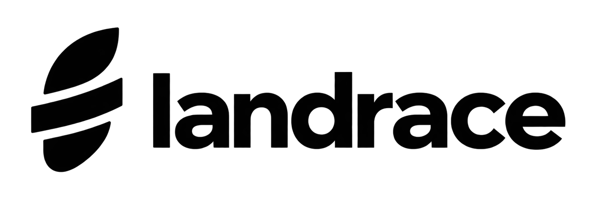
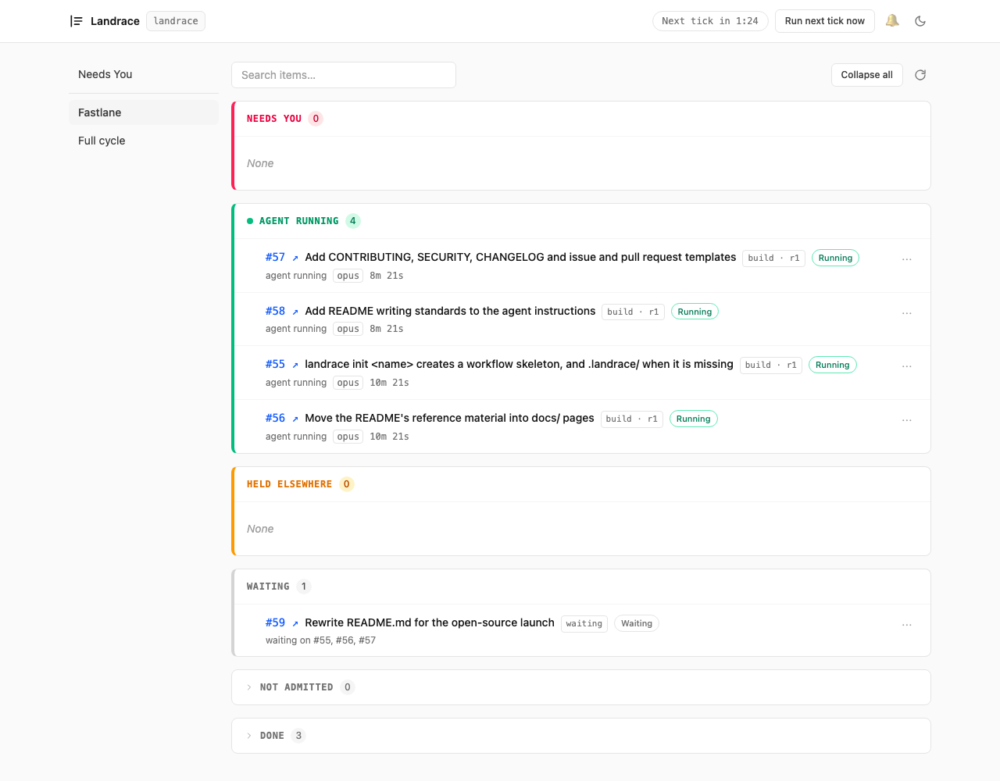
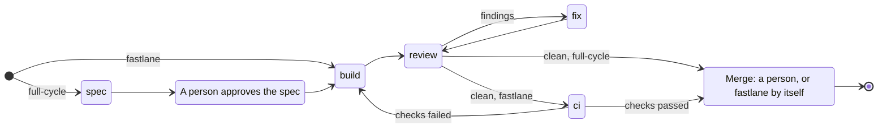
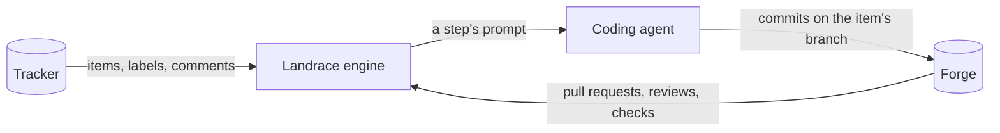
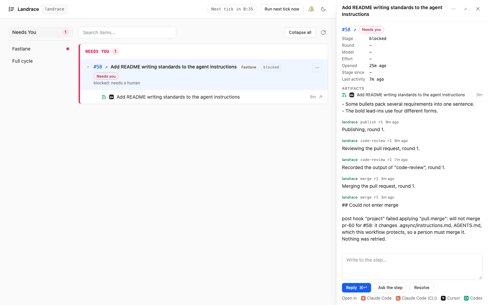

<p align="center">
  <picture>
    <source media="(prefers-color-scheme: dark)" srcset="docs/assets/logo-dark.png">
    
  </picture>
</p>

<p align="center"><strong>Turn labelled issues into merged pull requests. Agents work; code decides.</strong></p>

<p align="center">Landrace watches your issue tracker and moves each issue through spec, build, review and merge: coding agents do the work, and a workflow file you can read decides every next step.</p>

<p align="center">
  <a href="https://github.com/yiftahb/landrace/actions/workflows/ci.yml"></a>
  <a href="LICENSE"></a>
  <a href="package.json"></a>
</p>

<p align="center">
  <a href="#quick-start">Quick start</a> · <a href="docs/README.md">Docs</a> · <a href="#the-two-workflows">Workflows</a> · <a href="CONTRIBUTING.md">Contributing</a>
</p>

<picture>
  <source media="(prefers-color-scheme: dark)" srcset="docs/assets/board-waiting-dark.png">
  
</picture>

<p align="center"><em>Landrace working on its own launch: four agents build in parallel while the README item waits on three of them.</em></p>

## What it does

Landrace watches your issue tracker. Each issue it works on is an **item**, and a **workflow** moves the item through **stages**: spec, build, review, fix, CI and merge. At some stages a coding agent, such as Claude Code or Codex, does one piece of work, called a **step**. It writes the spec, the code, the review or the fix.

The agent never chooses what happens next. It answers with a value, and a rule in the workflow routes on that value. A deterministic state machine decides every step, and a person decides at the gates you choose. This repository ships two workflows: **full-cycle** starts with a written spec, and **fastlane**, for small changes, starts at the build.



## Why Landrace

- **The workflow is a file you can read.** Every transition is a rule in a `workflow.yaml` that you can diff and review. `landrace validate` checks that every loop has a bound before anything runs.
- **No hidden state.** Landrace keeps no database. On every pass it re-derives each item's stage and history from the tracker: a label, its own comments, the review threads. After a crash it recovers by reading them again.
- **Ambiguity halts instead of guessing.** When two rules match, Landrace stops the item and says why. A stopped item is a **halt**, and it waits for a person.
- **Local-first.** Landrace runs on your machine, with your coding agent and your git credentials. There is no server to host and no cloud sandbox.
- **A person at the gates you choose, or none.** A stage can wait for a person to approve a spec or merge a pull request. Fastlane merges by itself unless the change touches a **protected path**, a file that changes how Landrace itself runs.

## Quick start

You need Node 22 or newer with pnpm, a GitHub repository and a classic token with the `repo` scope, and Claude Code or Codex installed.

Landrace is not on npm yet, so build it from a clone and install it from there. In your repository's root:

```bash
git clone https://github.com/yiftahb/landrace.git ../landrace && pnpm -C ../landrace install && pnpm -C ../landrace build
npm install --save-dev ../landrace
npx landrace init main
```

`npm install` records Landrace as a `file:../landrace` dependency, so CI and other clones need the same clone beside the repository.

`init` writes `.landrace/`: a commented `landrace.yaml`, and a workflow named `main` that takes issues labelled `lr:main`. It also adds `.landrace/.env` to `.gitignore`. Before you start it, connect it to GitHub and Claude Code.

1. Create `.landrace/hooks/project.ts`. A **hook** is a TypeScript module that connects Landrace to a tracker, a **forge** (where pull requests live) or a coding agent:

   ```ts
   import { compose } from "landrace/kit";
   import { GitHubForge, GitHubIssues, GitHubPages } from "landrace/integrations/github";
   import { Claude } from "landrace/integrations/claude";

   export const { preflight, source, operator, pre, post, spec } = compose({
     tracker: new GitHubIssues(), forge: new GitHubForge({ closingRefs: true }), docs: new GitHubPages(),
   });
   export const claude = new Claude();
   ```

2. Replace `.landrace/landrace.yaml` with this, naming your own repository:

   ```yaml
   version: 1
   agent:
     adapter: claude
   tracker:
     repo: your-org/your-repo   # your GitHub repository, as owner/name
   secrets:
     githubToken: $GITHUB_TOKEN
   log:
     redact: [githubToken]
   ```

3. In `.landrace/workflows/main/workflow.yaml`, uncomment `hooks:` and list `../../hooks/project.ts` under it.
4. Put your token in `.landrace/.env`, as `GITHUB_TOKEN=` followed by the token.

Using Codex instead? Its hook and settings are in [Integrations](docs/integrations.md#codex). Then start Landrace:

```bash
npx landrace start
```

`start` checks the token's permissions, then serves the **board** at `http://127.0.0.1:4545/`. Every 60 seconds it runs a **tick**: one pass over the tracker's issues.

To give it work, label an issue `lr:main`. On the next tick the issue enters the `todo` stage, and the board lists it under Waiting. The workflow `init` wrote runs no agent yet, so the issue stays there. To run one, give `todo` a step, as [Workflows](docs/workflows.md#step-files) shows. A step that changes files reaches only the hosts listed under `agent.sandbox.hosts`, so list your forge and package registry there: see [A write step's sandbox](docs/security.md#a-write-steps-sandbox). Each step is a paid agent run, and a cap in the workflow bounds how many times each step runs.

## The two workflows

Both shipped workflows are examples. Their hooks, step prompts and protected paths are this repository's own, so a copy needs them changed. Each open item is **claimed** by exactly one workflow, decided by its labels.

| | full-cycle | fastlane |
|---|---|---|
| For | A change worth a written spec | A change small enough to need no spec |
| Labels | `lr:auto` | `lr:auto` and `lr:fast` |
| Path | spec → approval → build → review ⇄ fix → merge | build → review ⇄ fix → CI → merge |
| Who merges | A person | Landrace, once the review and the checks pass |
| Stops for a person | To answer the spec's questions, to approve the spec, to merge, or when a review loop reaches its cap | When the change touches a protected path, or when a review loop reaches its cap |

Both also stop for a person at a halt: a step whose output was broken, a push the forge refused, or a blocker that was dropped. Fastlane's protected paths are `.landrace/`, CI, pnpm's dependency files and the agents' instructions. Every stage, cap and protected path is in [Workflows](docs/workflows.md#the-shipped-workflows).

## The board

`landrace start` serves the board on `127.0.0.1` only. It shows:

- **Needs You**, the home page: every item waiting for a person, across all workflows, most urgent first.
- **A page per workflow**, with its items in lanes: Needs you, Agent running, Held elsewhere, Waiting, Not admitted and Done.
- **An item's panel**: its stage, its pull requests and spec, its conversation with Landrace, and its relationships to other items.

From the board, a person can reply on an item, ask the step that last ran a question, then hand the item back to its workflow. They can retry a failed step, or send an item back to an earlier step. They can also take a step over in their own terminal, which Landrace calls pairing. Browser notifications say when an item needs you.

The same reads and writes are MCP tools, so Claude Code, Codex or Cursor can drive Landrace through `landrace mcp`: see [the operator tools](docs/cli.md#the-operator-tools).

## Dependencies

"Blocked by" on the tracker holds an item until its blockers are done. It is a **relationship**, a typed link from one item to another: GitHub's issue dependencies, or Jira's "Blocks" links. Both workflows hold a blocked item before it builds, and the board shows it under Waiting with a note such as `waiting on #55, #56, #57`. A blocker that was dropped, cannot be read, or sits on a cycle sends the item to a person instead. See [Waiting on blockers](docs/workflows.md#waiting-on-blockers).

## How it works



- **The pure core decides.** From one snapshot of an item, it finds the item's stage and what happens next. It does no I/O, reads no clock and draws no random numbers.
- **Hooks talk to the world.** Hooks read and write the tracker and the forge, and run the coding agent. The engine itself names no vendor.
- **Effects belong to stages.** An **effect** is a write, such as a label, a comment or a merge. A stage lists the effects of being in it.
- **Each effect knows when it is done.** A pass that runs twice writes each effect once, so a crash mid-pass is safe.
- **State is derived.** An item's stage is a label, and its rounds are a count of Landrace's own comments, read again on every pass.
- **Read more** in [Architecture](docs/architecture.md): the layers, the loop and the item graph.

## Integrations

Landrace develops itself on GitHub, Claude Code and Slack. The others pass their tests offline, but nobody has checked them against the live service yet.

| Integration | Role | Status |
|---|---|---|
| [GitHub](docs/integrations.md#github) | Tracker (issues), forge (pull requests), docs (Pages) | Runs this repository. Blockers in another repository are not checked live yet |
| [GitLab](docs/integrations.md#gitlab) | Forge (merge requests) | Tested offline. Not checked live yet |
| [Jira](docs/integrations.md#jira) | Tracker (Jira Cloud issues) | Tested offline. Not checked live yet |
| [Notion](docs/integrations.md#notion) | Docs (spec pages) | Tested offline. Not checked live yet |
| [Slack](docs/integrations.md#slack) | Notifications | Runs this repository |
| [Claude Code](docs/integrations.md#claude-code) | Coding agent | Runs this repository |
| [Codex](docs/integrations.md#codex) | Coding agent | Written against codex-cli 0.154 and tested offline. Not run live yet |

GitHub, GitLab, Jira and Notion each have a script that checks the integration against a live account. To connect something else, see [Writing an integration](docs/hooks.md).

## Safety

- **Write steps run sandboxed.** A step that may change files runs its shell commands in the coding agent's OS sandbox. Under Claude Code, those commands write only to the step's worktree and the repository's git directory, and reach only the hosts you list. In-process tools such as WebFetch follow Claude Code's own permission rules instead. Codex's sandbox keeps less: see [Integrations](docs/integrations.md#codex).
- **The agent never holds the tracker's token.** Landrace makes every tracker and forge write itself: pull requests, comments and labels. A write step pushes its own branch with your git credentials, so protect your default branch on the forge before you run one.
- **Untrusted text cannot forge control state.** Everything Landrace writes ends in a hidden marker, and only the last marker in a comment counts. Landrace escapes text it did not write, so neither an agent nor a commenter can fake a Landrace record.
- **Prompts are screened.** Before any step that can act, a separate agent run with no tools checks the prompt for injected instructions.
- **Fastlane never merges a protected path without a person.** It merges only the commit the review read, when no check on it has failed or is still running. A commit with no checks counts as passing, so require status checks on your default branch.
- **What runs on your machine:** Landrace, as one process; the coding agent's CLI, in a git worktree per item under your temporary folder; and the board, on `127.0.0.1`. Landrace reaches the outside only through your hooks, and through telemetry when you turn it on.

<picture>
  <source media="(prefers-color-scheme: dark)" srcset="docs/assets/needs-you-dark.png">
  
</picture>

<p align="center"><em>Fastlane stopped at the merge because the change touched a protected path, and handed it to a person.</em></p>

To report a vulnerability, follow [SECURITY.md](SECURITY.md). The threat model, and the checklist for your first fastlane item, are in [Security](docs/security.md).

## Documentation

| Start here | When you need |
|---|---|
| [Architecture](docs/architecture.md) | To understand how Landrace decides: the layers, the pure core, derived state, ambiguity halts, effects and the item graph |
| [Configuration](docs/configuration.md) | To set up `landrace.yaml` or `.env`: every key and its default, `vars`, notifications and telemetry |
| [Workflows](docs/workflows.md) | To read or write a `workflow.yaml` or a step file, or to know how full-cycle and fastlane behave |
| [validate](docs/validate.md) | To know what `landrace validate` reported, or why it said nothing |
| [Command line](docs/cli.md) | A command or a flag, the board, or the MCP tools |
| [Integrations](docs/integrations.md) | To set up GitHub, GitLab, Jira, Notion, Slack, Claude Code or Codex: tokens, limits and live checks |
| [Writing an integration](docs/hooks.md) | To connect a tracker, forge, docs site, notifier or coding agent Landrace does not ship |
| [Security](docs/security.md) | To know what Landrace trusts, what it guards, and what to set up before letting it merge |
| [Development](docs/development.md) | To work on Landrace itself: the toolchain, the gate, tests and code rules |

## Contributing

Contributions are welcome. [CONTRIBUTING.md](CONTRIBUTING.md) says what a change needs to be merged: the gate, tests first, and the boundaries the code keeps.

## License

Landrace is released under the [MIT License](LICENSE).
